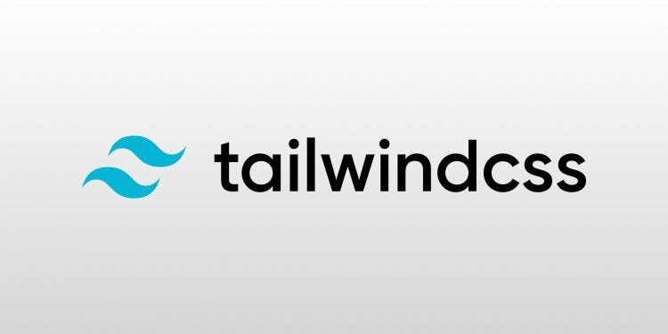
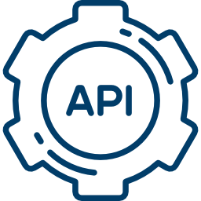

<p align="center">
  
</p>

<p align="center">
  <a href="https://laravel.com"></a>
  <a href="https://vuejs.org"></a>
  <a href="https://www.typescriptlang.org/"></a>
  <a href="https://tailwindcss.com"></a>
  <a href="https://github.com/acidjazz/metapi"></a>
</p>


## Laravel + Nuxt.js 

[](https://nuxtjs.org)
[](https://laravel.com)


[](https://github.com/acidjazz/laranuxt/actions/workflows/lint-js.yml)
[](https://github.com/acidjazz/laranuxt/actions/workflows/lint-php.yml)


### What is included

* [NUXT](https://nuxtjs.org) front end, a progressive Vue.js framework - `v2.15.8`
  * [@nuxtjs/typescript-build](https://typescript.nuxtjs.org/) TypeScript Support for Nuxt.js
  * [@nuxtjs/composition-api](https://composition-api.nuxtjs.org/) Composition API Support for Nuxt.js
  * [@nuxtjs/tailwindcss](https://tailwindcss.nuxtjs.org/) a [utility-first](https://tailwindcss.com) framework - now with PurgeCSS built in
  * [@nuxtjs/axios](https://github.com/nuxt-community/axios-module) to communicate with our API 
  * [nuxt-tailvue](https://github.com/acidjazz/nuxt-tailvue) a collection of components built for Nuxt.js, powered by TailwindCSS

* [Laravel](https://laravel.com) - for our API - `v8.60.0`
  * [MetAPI](https://github.com/acidjazz/metapi) - API helpers and utilities
  * [debugbar](https://github.com/barryvdh/laravel-debugbar) - awesome debugbar for our API
  * [ide-helper](https://github.com/barryvdh/laravel-ide-helper) - Helper files to enable help with IDE autocompletion

### Installation

* clone from GitHub
* run `npm install` / `yarn` and `composer install` to install all of your deps
* copy `.env.example` to `.env` and configure it mainly for database settings / app key
* create db tables with php artisan migrate
* create 
* TL;DR
 ```bash
git clone <gitrepourl>; cd <projectfolder>; npm install / yarn; composer install; cp .env.example .env; php artisan migrate
 ```
* Feel free to delete excess media in  `/client/static/`, just images for the readme


### Before running 
* edit nuxt.config.js for the api url changes on axios
* edit tsconfig.json jsconfig.json for tailwind and typescript configuration

### Local Environment (yarn way)
* run `yarn dev` in one terminal for our nuxt dev setup
* run `yarn api` (alias for `./artisan serve`) in another terminal for our laravel API

### Local Environment (npm way)
* run `npm run dev` in one terminal for our nuxt dev setup
* run `php artisan serve` (alias for `./artisan serve`) in another terminal for our laravel API  OR you can run under a webserver but supports PHP version after 8. 


### Video to include
### Project description to include


### Enjoy !